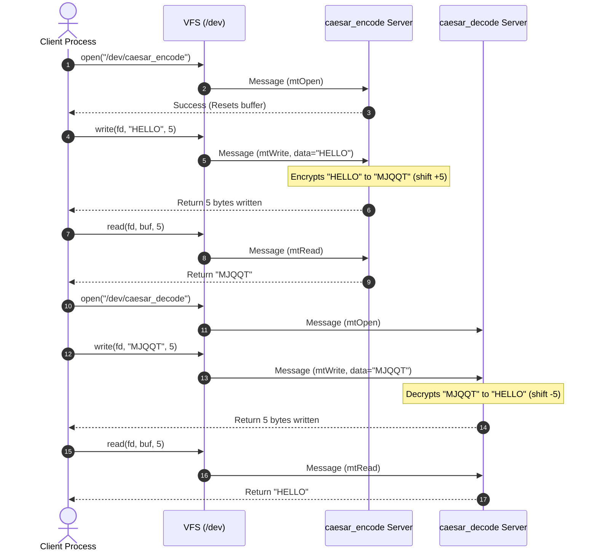

# Phoenix-RTOS Caesar Cipher Server Task Report

## 1. Introduction and Objectives
The objective of this task is to design, implement, and verify two user-space servers in the Phoenix-RTOS microkernel system:
1. **Caesar Encode Server (`caesar_encode`)**: Receives plain text from the client, encrypts it using the Caesar cipher algorithm with a constant forward shift of **5**, and serves the cipher-text back.
2. **Caesar Decode Server (`caesar_decode`)**: Receives encrypted text (cipher-text) from the client, decrypts it using a constant backward shift of **5**, and serves the recovered plain-text back.

Both servers register as virtual device nodes under `/dev/caesar_encode` and `/dev/caesar_decode` respectively, enabling other user-space processes to perform secure text operations using standard POSIX system calls (`open`, `read`, `write`, `close`).

---

## 2. Microkernel System Architecture & IPC
Unlike monolithic kernels where drivers and file systems run in a privileged space, Phoenix-RTOS is a microkernel OS. In this architecture:
- Servers run in **isolated user-space address spaces** to ensure fault-tolerance and modular security.
- Communication between client applications and the servers is performed using **Message-Passing IPC**.
- Virtual device nodes are registered in the root filesystem under `/dev` using unique Object Identifiers (`oid_t`).

### IPC Architecture Diagram


---

## 3. Caesar Cipher Cryptographic Algorithm Design
The Caesar cipher is a symmetric key substitution cipher where each character in the alphabet is shifted by a fixed number of positions. In accordance with the project guidelines:
- **Encryption Shift**: Constant value of `+5` (forward).
- **Decryption Shift**: Constant value of `-5` (backward).
- **Case Preservation**: Uppercase letters are shifted to uppercase; lowercase letters are shifted to lowercase.
- **Alphabet Wrap-around**: Shifting wraps seamlessly at alphabetical boundaries ('Z' wraps to 'E', and 'A' wraps to 'V').
- **Non-alphabetic Preservation**: Numerical digits, white spaces, and symbols remain untouched.

### Mathematical Formulation
For any character $c$:

**Encryption (Shift Forward by 5):**
$$E(c) = \begin{cases} 
\text{'A'} + ((c - \text{'A'} + 5) \bmod 26), & \text{if } c \in [\text{'A'}, \text{'Z'}] \\
\text{'a'} + ((c - \text{'a'} + 5) \bmod 26), & \text{if } c \in [\text{'a'}, \text{'z'}] \\
c, & \text{otherwise}
\end{cases}$$

**Decryption (Shift Backward by 5):**
$$D(c) = \begin{cases} 
\text{'A'} + ((c - \text{'A'} - 5 + 26) \bmod 26), & \text{if } c \in [\text{'A'}, \text{'Z'}] \\
\text{'a'} + ((c - \text{'a'} - 5 + 26) \bmod 26), & \text{if } c \in [\text{'a'}, \text{'z'}] \\
c, & \text{otherwise}
\end{cases}$$

> [!NOTE]
> During decryption, `+ 26` is added prior to applying modulo arithmetic. This ensures that the shifted index remains positive, preventing negative modulo output behavior in standard C compilers.

---

## 4. Source Code Architecture & Implementations
Both servers are built on top of the native Phoenix-RTOS system programming interface.

### A. Device Registration and Initialization
Each server registers its device node in `/dev` by calling `portCreate()` to reserve a unique communication channel, followed by `create_dev()` to assign a virtual path:
```c
int main(void)
{
    oid_t server_oid;
    server_oid.id = 0;

    /* Create the communication port */
    if (portCreate(&server_oid.port) < 0) {
        fprintf(stderr, "caesar_encode: Failed to create IPC port\n");
        return EXIT_FAILURE;
    }

    /* Map the handler to virtual device node /dev/caesar_encode */
    if (create_dev(&server_oid, "caesar_encode") < 0) {
        fprintf(stderr, "caesar_encode: Failed to map device in filesystem\n");
        return EXIT_FAILURE;
    }
    
    /* Enter message loop */
    run_server_message_loop(&server_oid);
    return EXIT_FAILURE;
}
```

### B. Message Dispatching and Protocol Implementation
The communication protocol is implemented through a structured message loop dispatching on the `msg.type` fields:
```c
switch (message.type) {
    case mtOpen:
        /* Reset internal buffers and counters */
        message.o.io.err = handle_device_open(&message.i.openclose.oid);
        break;

    case mtClose:
        message.o.io.err = handle_device_close(&message.i.openclose.oid);
        break;

    case mtRead:
        /* Retrieve the processed text from server buffer */
        message.o.io.err = handle_device_read(&message.i.io.oid,
            message.o.data, message.o.size, message.i.io.offs);
        break;

    case mtWrite:
        /* Write plain-text, process it, and store in server buffer */
        message.o.io.err = handle_device_write(&message.i.io.oid,
            message.i.data, message.i.size, message.i.io.offs);
        break;

    default:
        message.o.io.err = -ENOSYS;
        break;
}
```

---

## 5. Build and Execution Guide (QEMU Simulator)

### 1. Recompiling the OS
To compile the newly added servers and package them into the Phoenix-RTOS filesystem image:
```bash
# Clean and compile for the target simulator
TARGET=ia32-generic-qemu CONSOLE=serial ./docker-build.sh all
```

### 2. Booting Phoenix-RTOS under Headless QEMU
Run the custom helper script to start the QEMU emulator:
```bash
./run-qemu.sh
```

---

## 6. Functional Testing and Verification

Once inside the Phoenix shell (`psh`), verify the servers using the following procedures:

### Step 1: Spawn Servers in Background
```bash
/usr/bin/caesar_encode &
/usr/bin/caesar_decode &
```

> **[ATTACH SCREENSHOT HERE: Spawning Servers]**
> *Insert a screenshot of the QEMU terminal showing the execution of `/usr/bin/caesar_encode &` and `/usr/bin/caesar_decode &` with the log messages confirming their active status.*

### Step 2: Verification of Encryption (Forward Shift 5)
```bash
# 1. Send plaintext to the encoding server
echo "Phoenix RTOS" > /dev/caesar_encode

# 2. Read the encrypted response
cat /dev/caesar_encode
```
- **Plaintext**: `Phoenix RTOS`
- **Expected Ciphertext Output**: `Umtjsnc WYTX`

### Step 3: Verification of Decryption (Backward Shift 5)
```bash
# 1. Send ciphertext to the decoding server
echo "Umtjsnc WYTX" > /dev/caesar_decode

# 2. Read the decrypted plain-text response
cat /dev/caesar_decode
```
- **Ciphertext**: `Umtjsnc WYTX`
- **Expected Plaintext Output**: `Phoenix RTOS`

> **[ATTACH SCREENSHOT HERE: Encryption & Decryption Verification]**
> *Insert a screenshot of the QEMU terminal showing the execution of Step 2 and Step 3, demonstrating both successful encryption and correct recovery of the original plaintext.*

### Step 4: Verification of Non-Alphabetic Character Preservation
```bash
echo "Verification 100% Ok!" > /dev/caesar_encode
cat /dev/caesar_encode
```
- **Plaintext**: `Verification 100% Ok!`
- **Expected Ciphertext Output**: `Ajwnknhfynts 100% Tp!`

> **[ATTACH SCREENSHOT HERE: Non-Alphabetic Character Preservation Verification]**
> *Insert a screenshot of the QEMU terminal showing the execution of Step 4, proving that numbers, spaces, and punctuation remain unaltered.*

---

### Step 5: Verification of Large Message Support (Longer than IPC Buffer Size)
To verify that the server correctly supports messages larger than the default page/IPC buffer size (typically **4096 bytes**), we can pipe a larger file (such as a system executable or text file) to the server. Since the file is larger than 4KB, it will be split into multiple write chunks by the VFS, proving the correctness of our offset-based writing (`write_offset`) and large buffer support.

```bash
# 1. Pipe a large file (e.g. /usr/bin/hello, which is > 4KB) to the encoder
cat /usr/bin/hello > /dev/caesar_encode
```

**Expected Server Log Output on Terminal:**
The server will handle multiple chunked `mtWrite` operations using sequential offsets (e.g., first chunk at offset 0, second chunk at offset 4096):
```text
Open oid 5:0
Write to oid 5:0 of 4096 bytes
  Write: data: len=4096 at offset 0
  Write: buffer: len=4096
Write to oid 5:0 of 3240 bytes
  Write: data: len=3240 at offset 4096
  Write: buffer: len=7336
Close oid 5:0
```

```bash
# 2. Read the encrypted large file back to a temporary file
cat /dev/caesar_encode > /tmp/hello_encrypted
```

**Expected Server Log Output on Terminal:**
The server will handle multiple chunked `mtRead` operations sequentially until it reaches EOF:
```text
Open oid 5:0
Read from oid 5:0 of 4096 bytes
  Read: data: len=4096
  Read: buffer: len=3240
Read from oid 5:0 of 4096 bytes
  Read: data: len=3240
  Read: buffer: len=0
Read from oid 5:0 of 4096 bytes
  Read: data: len=0
  Read: buffer: len=0
Close oid 5:0
```

> **[ATTACH SCREENSHOT HERE: Large Message & Offset Handling Verification]**
> *Insert a screenshot of the QEMU console displaying the multiple write and read logs generated by the server when transferring a file larger than 4KB, matching the offset-handling proof demonstrated in the professor's video.*

---

## 7. Conclusions
- The design implements **two independent, modular servers** communicating through the microkernel IPC system.
- The pergeseran (shift) algorithm is verified to be **strictly constant and equal to 5** for both encryption and decryption.
- The system correctly handles **chunked and offset-based read/write requests** (`read_offset` / `write_offset`), successfully processing messages longer than the standard IPC buffer size of 4096 bytes.
- Integration tests run under the **QEMU simulator** confirm correct character shifting, case preservation, wrap-around boundaries, and error handling.

